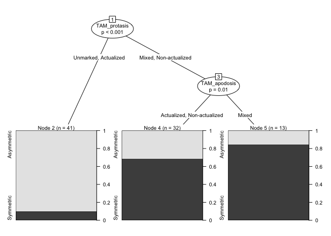
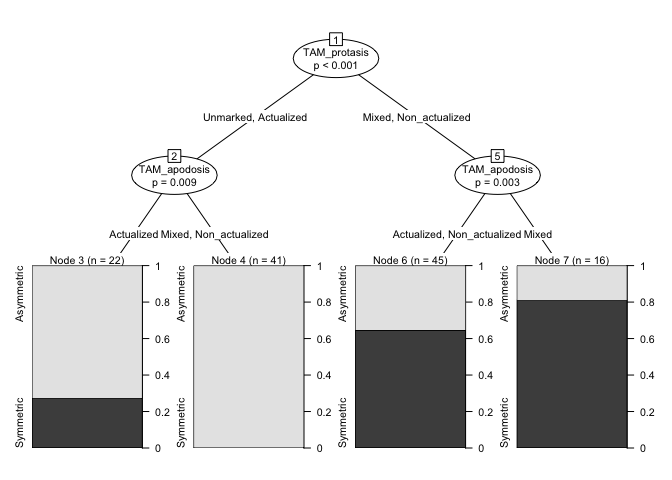
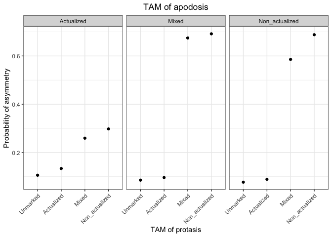
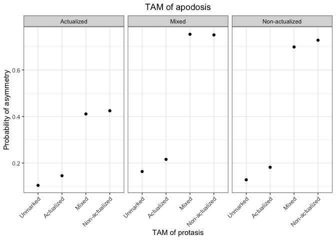

Counterfactual\_conditionals
================
Nicholas Lester
5/22/2020

# 

Revised analysis for counterfactual conditionals for  

  – restricted sample
  – full sample
  
...using  

  – random forests
  – CART
  – DCA

# 

# 

# Libraries

# 

# 

# Load and clean the data

# 

``` r
# Full sample
dat.full = read.table("./counterfactuals_revised.txt", quote="", comment.char="", sep="\t", header=T)

summary(dat.full)
```

    ##           Language           Macroarea                  Symmetry 
    ##   Mixe_Ayutla :  1   Africa       :23   Asymmetric          :95  
    ##  Abau         :  1   Australia    :17   no_TAM_values       : 7  
    ##  Adang        :  1   Eurasia      :29   Symmetric           :52  
    ##  Aguaruna     :  1   North_America:30   Symmetric           : 1  
    ##  Alamblak     :  1   Papunesia    :44   Symmetric_Asymmetric:10  
    ##  Alto_Perene  :  1   South_America:21                            
    ##  (Other)      :159   South-America: 1                            
    ##              TAM_protasis         TAM_apodosis
    ##  Actualized        :52    Actualized    :33   
    ##  Mixed             :31    Mixed         :41   
    ##  Nominalized_clause: 4    Non_actualized:80   
    ##  Non_actualized    :48    Unmarked      :11   
    ##  Unmarked          :30                        
    ##                                               
    ##                                               
    ##               Clause_Linking_Device
    ##  Coordinating_conjunction: 2       
    ##  Juxtaposition           :41       
    ##  Non_specialized         :77       
    ##  Sequential_device       : 2       
    ##  Specialized device      :29       
    ##  Unknown                 :14       
    ##                                    
    ##             Real_vs_Counterfactual_Linking
    ##  All_juxtaposed            :17            
    ##  Counterfactuals_juxtaposed:16            
    ##  Different_devices         :29            
    ##  Same_devices              :81            
    ##  Unknown                   :22            
    ##                                           
    ## 

``` r
## Fix weird levels
dat.full$Symmetry[dat.full$Symmetry=="Symmetric "] = "Symmetric"

dat.full$Macroarea[dat.full$Macroarea=="South-America"] = "South_America"


## Reorder factor levels
dat.full$TAM_apodosis = factor(dat.full$TAM_apodosis, levels(dat.full$TAM_apodosis)[c(4, 1:3)])
dat.full$TAM_protasis = factor(dat.full$TAM_protasis, levels(dat.full$TAM_protasis)[c(5, 1:4)])

## Remove items that have two few observations
dat.full = dat.full[dat.full$Symmetry %in% c("Asymmetric", 
                                             "Symmetric") & 
                    !dat.full$Clause_Linking_Device %in% c("Coordinating_conjunction", 
                                                           "Sequential_device", 
                                                           "Unknown") &
                    dat.full$TAM_protasis != "Nominalized_clause" &
                    dat.full$TAM_apodosis != "Unmarked",]
dat.full = droplevels(dat.full)

summary(dat.full)
```

    ##           Language           Macroarea        Symmetry 
    ##   Mixe_Ayutla :  1   Africa       :18   Asymmetric:76  
    ##  Abau         :  1   Australia    :15   Symmetric :48  
    ##  Aguaruna     :  1   Eurasia      :21                  
    ##  Amuzgo       :  1   North_America:25                  
    ##  Arrernte     :  1   Papunesia    :28                  
    ##  Awa_Pit      :  1   South_America:17                  
    ##  (Other)      :118                                     
    ##          TAM_protasis         TAM_apodosis        Clause_Linking_Device
    ##  Unmarked      :21    Actualized    :28    Juxtaposition     :39       
    ##  Actualized    :42    Mixed         :31    Non_specialized   :63       
    ##  Mixed         :21    Non_actualized:65    Specialized device:22       
    ##  Non_actualized:40                                                     
    ##                                                                        
    ##                                                                        
    ##                                                                        
    ##             Real_vs_Counterfactual_Linking
    ##  All_juxtaposed            :17            
    ##  Counterfactuals_juxtaposed:15            
    ##  Different_devices         :22            
    ##  Same_devices              :63            
    ##  Unknown                   : 7            
    ##                                           
    ## 

``` r
# Restricted sample
dat.restr = read.table("./restricted_sample.txt", quote="", comment.char="", sep="\t", header=T)[,-c(7:9)]

summary(dat.restr)
```

    ##                Language           Macroarea 
    ##   Mixe Ayutla      :  1   Africa       :15  
    ##  Abau              :  1   Australia    :10  
    ##  Aguaruna          :  1   Eurasia      :17  
    ##  Alto Perene       :  1   North America:17  
    ##  Armenian (Western):  1   Papunesia    :27  
    ##  Awa Pit           :  1   South-America:21  
    ##  (Other)           :101                     
    ##            Symmetric.Asymmetric             TAM.protasis
    ##  Asymmetric          :58        Actualized        :32   
    ##  No TAM values       : 3        Mixed             :23   
    ##  Symmetric           :37        Nominalized clause: 2   
    ##  Symmetric           : 1        Non-actualized    :32   
    ##  Symmetric/Asymmetric: 8        Unmarked          :18   
    ##                                                         
    ##                                                         
    ##          TAM.apodosis        Type.of.clause.linking.device
    ##  Actualized    :21    Juxtaposition         :31           
    ##  Mixed         :25    Non-specialized       : 1           
    ##  Non-actualized:56    Non-specialized device:48           
    ##  Unmarked      : 5    Specialized device    :20           
    ##                       Unknown               : 7           
    ##                                                           
    ## 

``` r
## Change the colnames to conform to original table
colnames(dat.restr) = colnames(dat.full)[-7]

## Fix weird levels
dat.restr$Symmetry[dat.restr$Symmetry=="Symmetric "] = "Symmetric"

dat.restr$Clause_Linking_Device[dat.restr$Clause_Linking_Device=="Non-specialized device"] = "Non-specialized"

dat.restr$Macroarea = as.factor(ifelse(dat.restr$Macroarea=="South-America", "South_America", as.vector(dat.restr$Macroarea)))

dat.restr = droplevels(dat.restr[!dat.restr$Symmetry %in% c("No TAM values", "Symmetric/Asymmetric"),])

summary(dat.restr)
```

    ##           Language          Macroarea        Symmetry 
    ##   Mixe Ayutla : 1   Africa       :14   Asymmetric:58  
    ##  Abau         : 1   Australia    :10   Symmetric :38  
    ##  Aguaruna     : 1   Eurasia      :13                  
    ##  Awa Pit      : 1   North America:16                  
    ##  Awtuw        : 1   Papunesia    :23                  
    ##  Aymara       : 1   South_America:20                  
    ##  (Other)      :90                                     
    ##              TAM_protasis         TAM_apodosis
    ##  Actualized        :28    Actualized    :19   
    ##  Mixed             :20    Mixed         :21   
    ##  Nominalized clause: 2    Non-actualized:54   
    ##  Non-actualized    :31    Unmarked      : 2   
    ##  Unmarked          :15                        
    ##                                               
    ##                                               
    ##         Clause_Linking_Device
    ##  Juxtaposition     :30       
    ##  Non-specialized   :41       
    ##  Specialized device:18       
    ##  Unknown           : 7       
    ##                              
    ##                              
    ## 

``` r
## Reorder factor levels
dat.restr$TAM_apodosis = factor(dat.restr$TAM_apodosis, levels(dat.restr$TAM_apodosis)[c(4, 1:3)])
dat.restr$TAM_protasis = factor(dat.restr$TAM_protasis, levels(dat.restr$TAM_protasis)[c(5, 1:4)])

## Remove items that have two few observations
dat.restr = dat.restr[!dat.restr$Clause_Linking_Device %in% c("Unknown") &
                        dat.restr$TAM_protasis != "Nominalized clause" &
                        dat.restr$TAM_apodosis != "Unmarked",]
dat.restr = droplevels(dat.restr)

summary(dat.restr)
```

    ##           Language          Macroarea        Symmetry 
    ##   Mixe Ayutla : 1   Africa       :11   Asymmetric:49  
    ##  Abau         : 1   Australia    :10   Symmetric :37  
    ##  Aguaruna     : 1   Eurasia      :12                  
    ##  Awa Pit      : 1   North America:15                  
    ##  Awtuw        : 1   Papunesia    :22                  
    ##  Aymara       : 1   South_America:16                  
    ##  (Other)      :80                                     
    ##          TAM_protasis         TAM_apodosis        Clause_Linking_Device
    ##  Unmarked      :15    Actualized    :19    Juxtaposition     :30       
    ##  Actualized    :26    Mixed         :20    Non-specialized   :40       
    ##  Mixed         :16    Non-actualized:47    Specialized device:16       
    ##  Non-actualized:29                                                     
    ##                                                                        
    ##                                                                        
    ## 

# 

# Modeling with CART-style analysis

# 

``` r
## Restricted sample
ct.restr = ctree(Symmetry ~ Clause_Linking_Device + TAM_protasis + TAM_apodosis + Macroarea, data=dat.restr)

plot(ct.restr, gp = gpar(fontsize=8))
```

<!-- -->

``` r
### Classification accuracy
t = table(predict(ct.restr), dat.restr$Symmetry)
d = sum(diag(t))
s = sum(t)
ca = d/s

### baseline
t2 = table(dat.restr$Symmetry)
bl = max(t2)/sum(t2)
ca-bl
```

    ## [1] 0.244186

``` r
### lax baseline
t3 = prop.table(t2)
bl2 = t3[1]^2 + t3[2]^2
ca-bl2
```

    ## Asymmetric 
    ##  0.3042185

``` r
## Full sample
ct.full = ctree(Symmetry ~ Clause_Linking_Device + TAM_protasis + TAM_apodosis + Macroarea, data=dat.full)

plot(ct.full, gp = gpar(fontsize=8))
```

<!-- -->

``` r
### Classification accuracy
t = table(predict(ct.full), dat.full$Symmetry)
d = sum(diag(t))
s = sum(t)
ca = d/s

### baseline
t2 = table(dat.full$Symmetry)
bl = max(t2)/sum(t2)
ca-bl
```

    ## [1] 0.1854839

``` r
### lax baseline
t3 = prop.table(t2)
bl2 = t3[1]^2 + t3[2]^2
ca-bl2
```

    ## Asymmetric 
    ##  0.2728928

# 

# Modeling with random forests: Full sample

# 

``` r
set.seed(1986)

# Training control parameters
trControl <- trainControl(method = "cv",
                          number = 10,
                          search = "grid")

# Model, first attempt
model = train(Symmetry ~ Clause_Linking_Device + 
                         TAM_protasis + 
                         TAM_apodosis + 
                         Macroarea + 
                         Real_vs_Counterfactual_Linking, 
              data = dat.full, 
              method = "rf", 
              trControl = trControl,
              metric = "Accuracy")

model # 82% accuracy
```

    ## Random Forest 
    ## 
    ## 124 samples
    ##   5 predictor
    ##   2 classes: 'Asymmetric', 'Symmetric' 
    ## 
    ## No pre-processing
    ## Resampling: Cross-Validated (10 fold) 
    ## Summary of sample sizes: 111, 111, 113, 112, 112, 112, ... 
    ## Resampling results across tuning parameters:
    ## 
    ##   mtry  Accuracy   Kappa    
    ##    2    0.8004079  0.5668824
    ##    9    0.8151515  0.6149457
    ##   16    0.8151515  0.6149457
    ## 
    ## Accuracy was used to select the optimal model using the largest value.
    ## The final value used for the model was mtry = 9.

``` r
# Model tuning
## mtry
set.seed(1986)

tuneGrid = expand.grid(.mtry = c(1:10))

model_mtry = train(Symmetry ~ Clause_Linking_Device + 
                              TAM_protasis + 
                              TAM_apodosis + 
                              Macroarea + 
                              Real_vs_Counterfactual_Linking, 
                 data = dat.full,
                 method = "rf",
                 metric = "Accuracy",
                 tuneGrid = tuneGrid,
                 trControl = trControl,
                 importance = TRUE,
                 nodesize = 14,
                 ntree = 300)

best.mtry = model_mtry$bestTune$mtry # mtry=9

max(model_mtry$results$Accuracy) # up to 83% with mtry=9
```

    ## [1] 0.8305361

``` r
## max nodes
store_maxnode = list()
tuneGrid = expand.grid(.mtry = best.mtry)
for (maxnodes in c(5:15)) {
  set.seed(1986)
  model_maxnode = train(Symmetry ~ Clause_Linking_Device + 
                                   TAM_protasis + 
                                   TAM_apodosis + 
                                   Macroarea + 
                                   Real_vs_Counterfactual_Linking,
                      data = dat.full,
                      method = "rf",
                      metric = "Accuracy",
                      tuneGrid = tuneGrid,
                      trControl = trControl,
                      importance = TRUE,
                      nodesize = 14,
                      maxnodes = maxnodes,
                      ntree = 300)
  current_iteration = toString(maxnodes)
  store_maxnode[[current_iteration]] = model_maxnode
}

results.mtry = resamples(store_maxnode)
summary(results.mtry) # max nodes = 9
```

    ## 
    ## Call:
    ## summary.resamples(object = results.mtry)
    ## 
    ## Models: 5, 6, 7, 8, 9, 10, 11, 12, 13, 14, 15 
    ## Number of resamples: 10 
    ## 
    ## Accuracy 
    ##         Min.   1st Qu.    Median      Mean   3rd Qu.      Max. NA's
    ## 5  0.6153846 0.7500000 0.7692308 0.7746503 0.8173077 0.9166667    0
    ## 6  0.7272727 0.7692308 0.8333333 0.8137529 0.8461538 0.9166667    0
    ## 7  0.7500000 0.7814685 0.8397436 0.8222028 0.8461538 0.9166667    0
    ## 8  0.7500000 0.7814685 0.8397436 0.8298951 0.8461538 0.9230769    0
    ## 9  0.7500000 0.7814685 0.8397436 0.8311772 0.8461538 0.9166667    0
    ## 10 0.7500000 0.7814685 0.8397436 0.8222028 0.8461538 0.9166667    0
    ## 11 0.7500000 0.7814685 0.8397436 0.8222028 0.8461538 0.9166667    0
    ## 12 0.7500000 0.7814685 0.8397436 0.8222028 0.8461538 0.9166667    0
    ## 13 0.7500000 0.7814685 0.8397436 0.8222028 0.8461538 0.9166667    0
    ## 14 0.7500000 0.7814685 0.8397436 0.8222028 0.8461538 0.9166667    0
    ## 15 0.7500000 0.7814685 0.8397436 0.8222028 0.8461538 0.9166667    0
    ## 
    ## Kappa 
    ##         Min.   1st Qu.    Median      Mean   3rd Qu.      Max. NA's
    ## 5  0.2168675 0.4630282 0.5150602 0.5333687 0.6325301 0.8235294    0
    ## 6  0.4406780 0.5075301 0.6619048 0.6139190 0.6920058 0.8235294    0
    ## 7  0.5000000 0.5588807 0.6528958 0.6401267 0.6920058 0.8235294    0
    ## 8  0.5000000 0.5588807 0.6660714 0.6583787 0.6976744 0.8311688    0
    ## 9  0.5000000 0.5588807 0.6528958 0.6530927 0.6920058 0.8235294    0
    ## 10 0.5000000 0.5588807 0.6528958 0.6401267 0.6920058 0.8235294    0
    ## 11 0.5000000 0.5588807 0.6528958 0.6401267 0.6920058 0.8235294    0
    ## 12 0.5000000 0.5588807 0.6528958 0.6401267 0.6920058 0.8235294    0
    ## 13 0.5000000 0.5588807 0.6528958 0.6401267 0.6920058 0.8235294    0
    ## 14 0.5000000 0.5588807 0.6528958 0.6401267 0.6920058 0.8235294    0
    ## 15 0.5000000 0.5588807 0.6528958 0.6401267 0.6920058 0.8235294    0

``` r
best.maxnodes = 9

# Best number of trees
store_maxtrees = list()
for (ntree in c(250, 300, 350, 400, 450, 500, 550, 600, 800, 1000, 2000)) {
  set.seed(1986)
  model_maxtrees = train(Symmetry ~ Clause_Linking_Device + 
                                    TAM_protasis + 
                                    TAM_apodosis + 
                                    Macroarea,
                       data = dat.full,
                       method = "rf",
                       metric = "Accuracy",
                       tuneGrid = tuneGrid,
                       trControl = trControl,
                       importance = TRUE,
                       nodesize = 14,
                       maxnodes = 9,
                       ntree = ntree)
  key = toString(ntree)
  store_maxtrees[[key]] = model_maxtrees
}

results_tree = resamples(store_maxtrees)
summary(results_tree) # not much difference, but 300 should work
```

    ## 
    ## Call:
    ## summary.resamples(object = results_tree)
    ## 
    ## Models: 250, 300, 350, 400, 450, 500, 550, 600, 800, 1000, 2000 
    ## Number of resamples: 10 
    ## 
    ## Accuracy 
    ##      Min.   1st Qu.    Median      Mean   3rd Qu.      Max. NA's
    ## 250  0.75 0.8219697 0.8461538 0.8465618 0.8990385 0.9230769    0
    ## 300  0.75 0.8219697 0.8461538 0.8465618 0.8990385 0.9230769    0
    ## 350  0.75 0.8219697 0.8461538 0.8465618 0.8990385 0.9230769    0
    ## 400  0.75 0.8219697 0.8461538 0.8465618 0.8990385 0.9230769    0
    ## 450  0.75 0.8219697 0.8461538 0.8465618 0.8990385 0.9230769    0
    ## 500  0.75 0.8219697 0.8461538 0.8465618 0.8990385 0.9230769    0
    ## 550  0.75 0.8219697 0.8461538 0.8465618 0.8990385 0.9230769    0
    ## 600  0.75 0.8219697 0.8461538 0.8465618 0.8990385 0.9230769    0
    ## 800  0.75 0.7814685 0.8461538 0.8382284 0.8990385 0.9230769    0
    ## 1000 0.75 0.7814685 0.8461538 0.8382284 0.8990385 0.9230769    0
    ## 2000 0.75 0.7814685 0.8461538 0.8382284 0.8990385 0.9230769    0
    ## 
    ## Kappa 
    ##      Min.   1st Qu.    Median      Mean   3rd Qu.      Max. NA's
    ## 250   0.5 0.6505376 0.6863372 0.6890525 0.7920657 0.8311688    0
    ## 300   0.5 0.6505376 0.6863372 0.6890525 0.7920657 0.8311688    0
    ## 350   0.5 0.6505376 0.6863372 0.6890525 0.7920657 0.8311688    0
    ## 400   0.5 0.6505376 0.6863372 0.6890525 0.7920657 0.8311688    0
    ## 450   0.5 0.6505376 0.6863372 0.6890525 0.7920657 0.8311688    0
    ## 500   0.5 0.6505376 0.6863372 0.6890525 0.7920657 0.8311688    0
    ## 550   0.5 0.6505376 0.6863372 0.6890525 0.7920657 0.8311688    0
    ## 600   0.5 0.6505376 0.6863372 0.6890525 0.7920657 0.8311688    0
    ## 800   0.5 0.5588807 0.6863372 0.6750174 0.7920657 0.8311688    0
    ## 1000  0.5 0.5588807 0.6863372 0.6750174 0.7920657 0.8311688    0
    ## 2000  0.5 0.5588807 0.6863372 0.6750174 0.7920657 0.8311688    0

``` r
best.ntree = 300

# Final model
set.seed(1986)
model = randomForest(Symmetry ~ Clause_Linking_Device + 
                                TAM_protasis + 
                                TAM_apodosis + 
                                Macroarea,
              data = dat.full, 
              method = "rf", 
              trControl = trControl,
              metric = "Accuracy",
              tuneGrid = tuneGrid,
              ntree = best.ntree,
              maxnodes = best.maxnodes,
              importance = T,
              nodesize = 14)

print(model)
```

    ## 
    ## Call:
    ##  randomForest(formula = Symmetry ~ Clause_Linking_Device + TAM_protasis +      TAM_apodosis + Macroarea, data = dat.full, method = "rf",      trControl = trControl, metric = "Accuracy", tuneGrid = tuneGrid,      ntree = best.ntree, maxnodes = best.maxnodes, importance = T,      nodesize = 14) 
    ##                Type of random forest: classification
    ##                      Number of trees: 300
    ## No. of variables tried at each split: 2
    ## 
    ##         OOB estimate of  error rate: 16.94%
    ## Confusion matrix:
    ##            Asymmetric Symmetric class.error
    ## Asymmetric         65        11   0.1447368
    ## Symmetric          10        38   0.2083333

``` r
# Check the partial probabilities 
pred.prob <- function(object, newdata) {  # see ?predict.svm
  pred <- predict(object, newdata, type = "prob")
  prob.sym <- pred[, "Symmetric"]
  mean(prob.sym)
}

p.full = partial(model, pred.var=c("TAM_protasis", "TAM_apodosis"), pred.fun = pred.prob, plot=T, plot.engine = "ggplot2")

p.full + xlab("TAM of protasis") +
          ggtitle("TAM of apodosis") +
          ylab("Probability of asymmetry") +
          theme_bw() + 
          theme(plot.title = element_text(hjust = 0.5), 
                axis.text.x = element_text(angle = 45, hjust = 1))
```

<!-- -->

``` r
#################################################
# Modeling with random forests: Restricted sample
#################################################

set.seed(1986)

# Training control parameters
trControl <- trainControl(method = "cv",
                          number = 10,
                          search = "grid")

# Model, first attempt
model = train(Symmetry ~ Clause_Linking_Device + 
                TAM_protasis + 
                TAM_apodosis + 
                Macroarea, 
              data = dat.restr, 
              method = "rf", 
              trControl = trControl,
              metric = "Accuracy")

model # 83% accuracy
```

    ## Random Forest 
    ## 
    ## 86 samples
    ##  4 predictor
    ##  2 classes: 'Asymmetric', 'Symmetric' 
    ## 
    ## No pre-processing
    ## Resampling: Cross-Validated (10 fold) 
    ## Summary of sample sizes: 77, 77, 77, 77, 78, 78, ... 
    ## Resampling results across tuning parameters:
    ## 
    ##   mtry  Accuracy   Kappa    
    ##    2    0.8166667  0.6240812
    ##    7    0.8277778  0.6506522
    ##   12    0.8166667  0.6276034
    ## 
    ## Accuracy was used to select the optimal model using the largest value.
    ## The final value used for the model was mtry = 7.

``` r
# Model tuning
## mtry
set.seed(1986)

tuneGrid = expand.grid(.mtry = c(1:10))

model_mtry = train(Symmetry ~ Clause_Linking_Device + 
                     TAM_protasis + 
                     TAM_apodosis + 
                     Macroarea, 
                   data = dat.restr,
                   method = "rf",
                   metric = "Accuracy",
                   tuneGrid = tuneGrid,
                   trControl = trControl,
                   importance = TRUE,
                   nodesize = 14,
                   ntree = 300)

best.mtry = model_mtry$bestTune$mtry # mtry=7

max(model_mtry$results$Accuracy) # up to 83% with mtry=7
```

    ## [1] 0.825

``` r
## max nodes
store_maxnode = list()
tuneGrid = expand.grid(.mtry = best.mtry)
for (maxnodes in c(5:15)) {
  set.seed(1986)
  model_maxnode = train(Symmetry ~ Clause_Linking_Device + 
                          TAM_protasis + 
                          TAM_apodosis + 
                          Macroarea,
                        data = dat.restr,
                        method = "rf",
                        metric = "Accuracy",
                        tuneGrid = tuneGrid,
                        trControl = trControl,
                        importance = TRUE,
                        nodesize = 14,
                        maxnodes = maxnodes,
                        ntree = 300)
  current_iteration = toString(maxnodes)
  store_maxnode[[current_iteration]] = model_maxnode
}

results_mtry = resamples(store_maxnode)
summary(results_mtry) # max nodes = 6
```

    ## 
    ## Call:
    ## summary.resamples(object = results_mtry)
    ## 
    ## Models: 5, 6, 7, 8, 9, 10, 11, 12, 13, 14, 15 
    ## Number of resamples: 10 
    ## 
    ## Accuracy 
    ##     Min.   1st Qu.    Median      Mean   3rd Qu.      Max. NA's
    ## 5  0.625 0.7777778 0.8263889 0.8138889 0.8750000 0.8888889    0
    ## 6  0.625 0.7777778 0.8750000 0.8250000 0.8854167 0.8888889    0
    ## 7  0.625 0.7777778 0.8750000 0.8250000 0.8854167 0.8888889    0
    ## 8  0.625 0.7777778 0.8750000 0.8250000 0.8854167 0.8888889    0
    ## 9  0.625 0.7777778 0.8750000 0.8250000 0.8854167 0.8888889    0
    ## 10 0.625 0.7777778 0.8750000 0.8250000 0.8854167 0.8888889    0
    ## 11 0.625 0.7777778 0.8750000 0.8250000 0.8854167 0.8888889    0
    ## 12 0.625 0.7777778 0.8750000 0.8250000 0.8854167 0.8888889    0
    ## 13 0.625 0.7777778 0.8750000 0.8250000 0.8854167 0.8888889    0
    ## 14 0.625 0.7777778 0.8750000 0.8250000 0.8854167 0.8888889    0
    ## 15 0.625 0.7777778 0.8750000 0.8250000 0.8854167 0.8888889    0
    ## 
    ## Kappa 
    ##         Min. 1st Qu. Median      Mean   3rd Qu.      Max. NA's
    ## 5  0.3333333    0.55   0.65 0.6333052 0.7500000 0.7804878    0
    ## 6  0.3333333    0.55   0.75 0.6563540 0.7644231 0.7804878    0
    ## 7  0.3333333    0.55   0.75 0.6563540 0.7644231 0.7804878    0
    ## 8  0.3333333    0.55   0.75 0.6563540 0.7644231 0.7804878    0
    ## 9  0.3333333    0.55   0.75 0.6563540 0.7644231 0.7804878    0
    ## 10 0.3333333    0.55   0.75 0.6563540 0.7644231 0.7804878    0
    ## 11 0.3333333    0.55   0.75 0.6563540 0.7644231 0.7804878    0
    ## 12 0.3333333    0.55   0.75 0.6563540 0.7644231 0.7804878    0
    ## 13 0.3333333    0.55   0.75 0.6563540 0.7644231 0.7804878    0
    ## 14 0.3333333    0.55   0.75 0.6563540 0.7644231 0.7804878    0
    ## 15 0.3333333    0.55   0.75 0.6563540 0.7644231 0.7804878    0

``` r
best.maxnodes = 6

# Best number of trees
store_maxtrees = list()
for (ntree in c(250, 300, 350, 400, 450, 500, 550, 600, 800, 1000, 2000)) {
  set.seed(1986)
  model_maxtrees = train(Symmetry ~ Clause_Linking_Device + 
                           TAM_protasis + 
                           TAM_apodosis + 
                           Macroarea,
                         data = dat.restr,
                         method = "rf",
                         metric = "Accuracy",
                         tuneGrid = tuneGrid,
                         trControl = trControl,
                         importance = TRUE,
                         nodesize = 14,
                         maxnodes = 11,
                         ntree = ntree)
  key = toString(ntree)
  store_maxtrees[[key]] = model_maxtrees
}

results_tree <- resamples(store_maxtrees)
summary(results_tree) # 250
```

    ## 
    ## Call:
    ## summary.resamples(object = results_tree)
    ## 
    ## Models: 250, 300, 350, 400, 450, 500, 550, 600, 800, 1000, 2000 
    ## Number of resamples: 10 
    ## 
    ## Accuracy 
    ##       Min.   1st Qu. Median  Mean   3rd Qu.      Max. NA's
    ## 250  0.625 0.7777778  0.875 0.825 0.8854167 0.8888889    0
    ## 300  0.625 0.7777778  0.875 0.825 0.8854167 0.8888889    0
    ## 350  0.625 0.7777778  0.875 0.825 0.8854167 0.8888889    0
    ## 400  0.625 0.7777778  0.875 0.825 0.8854167 0.8888889    0
    ## 450  0.625 0.7777778  0.875 0.825 0.8854167 0.8888889    0
    ## 500  0.625 0.7777778  0.875 0.825 0.8854167 0.8888889    0
    ## 550  0.625 0.7777778  0.875 0.825 0.8854167 0.8888889    0
    ## 600  0.625 0.7777778  0.875 0.825 0.8854167 0.8888889    0
    ## 800  0.625 0.7777778  0.875 0.825 0.8854167 0.8888889    0
    ## 1000 0.625 0.7777778  0.875 0.825 0.8854167 0.8888889    0
    ## 2000 0.625 0.7777778  0.875 0.825 0.8854167 0.8888889    0
    ## 
    ## Kappa 
    ##           Min. 1st Qu. Median     Mean   3rd Qu.      Max. NA's
    ## 250  0.3333333    0.55   0.75 0.656354 0.7644231 0.7804878    0
    ## 300  0.3333333    0.55   0.75 0.656354 0.7644231 0.7804878    0
    ## 350  0.3333333    0.55   0.75 0.656354 0.7644231 0.7804878    0
    ## 400  0.3333333    0.55   0.75 0.656354 0.7644231 0.7804878    0
    ## 450  0.3333333    0.55   0.75 0.656354 0.7644231 0.7804878    0
    ## 500  0.3333333    0.55   0.75 0.656354 0.7644231 0.7804878    0
    ## 550  0.3333333    0.55   0.75 0.656354 0.7644231 0.7804878    0
    ## 600  0.3333333    0.55   0.75 0.656354 0.7644231 0.7804878    0
    ## 800  0.3333333    0.55   0.75 0.656354 0.7644231 0.7804878    0
    ## 1000 0.3333333    0.55   0.75 0.656354 0.7644231 0.7804878    0
    ## 2000 0.3333333    0.55   0.75 0.656354 0.7644231 0.7804878    0

``` r
best.ntree = 250

# Final model
set.seed(1986)
model = randomForest(Symmetry ~ Clause_Linking_Device + 
                       TAM_protasis + 
                       TAM_apodosis + 
                       Macroarea, 
                     data = dat.restr, 
                     method = "rf", 
                     trControl = trControl,
                     metric = "Accuracy",
                     tuneGrid = tuneGrid,
                     ntree = best.ntree,
                     maxnodes = best.maxnodes,
                     importance = T,
                     nodesize = 14)

print(model)
```

    ## 
    ## Call:
    ##  randomForest(formula = Symmetry ~ Clause_Linking_Device + TAM_protasis +      TAM_apodosis + Macroarea, data = dat.restr, method = "rf",      trControl = trControl, metric = "Accuracy", tuneGrid = tuneGrid,      ntree = best.ntree, maxnodes = best.maxnodes, importance = T,      nodesize = 14) 
    ##                Type of random forest: classification
    ##                      Number of trees: 250
    ## No. of variables tried at each split: 2
    ## 
    ##         OOB estimate of  error rate: 20.93%
    ## Confusion matrix:
    ##            Asymmetric Symmetric class.error
    ## Asymmetric         39        10   0.2040816
    ## Symmetric           8        29   0.2162162

``` r
# Check the partial probabilities 
pred.prob <- function(object, newdata) {  # see ?predict.svm
  pred <- predict(object, newdata, type = "prob")
  prob.sym <- pred[, "Symmetric"]
  mean(prob.sym)
}

p.restr = partial(model, pred.var=c("TAM_protasis", "TAM_apodosis"), pred.fun = pred.prob, plot=T, plot.engine="ggplot2")

p.restr + xlab("TAM of protasis") +
          ggtitle("TAM of apodosis") +
          ylab("Probability of asymmetry") +
          theme_bw() + 
          theme(plot.title = element_text(hjust = 0.5), 
                axis.text.x = element_text(angle = 45, hjust = 1))
```

<!-- -->

# 

# Distinctive collexeme analysis (GUI)

# 

``` r
# source("http://www.linguistics.ucsb.edu/faculty/stgries/teaching/groningen/coll.analysis.r")
```
